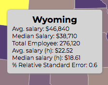

## topodata

#### [LIVE](https://topodata.henryhchen.com/)

### Proposal
This project is to show the average salary (wage) for all 50 states. Users has the ability to display historical data from 2011. Users will have the ability to filter by industry and also select the year. When users hover over each state, a tooltip will appear that shows additional details about that state.

### Features

####  Color Gradient based on the average salary


#### A year slider that allows user to view data from 2011 to 2016

```js
const slider = d3.select(".slider")
					.on("input", function() {
						d3.select(".year-label").html("Current Year: " + this.value);
						updateYear(Number(this.value));
						updateStats(userSelect, hoveredState);
					});

function updateYear(year){
	d3.queue()
	.defer(d3.json, "data/us_states_map.json")
	.defer(d3.csv, `data/data${year}.csv`)
	.await(ready2);
}
```

#### Tooltip that displays additional info on mouse hover

- State
- Average Salary
- Median Salary
- Total Employee
- Average Salary (Hourly)
- Median Salary (Hourly)
- Relative Standard Error (%)




#### Updating the variance calculations when mouse moves
```js
svg.append("g")
    .attr("class", "states")
  .selectAll("path")
  .data(topojson.feature(us, us.objects.states).features)
  .enter()
    .append("path")
    .attr("d", path)
    .style("fill", function(d){
      return colorScale(averageSalarybyState[d.properties.NAME]);
    })
    .on("mouseover", function(d, i){
      d3.select(this).style("fill", "yellow").transition().duration(300).style("cursor", "pointer").style("display", "block");
      //Updating Stats Box
      hoveredState = d.properties.NAME;
      updateStats(userSelect, hoveredState);
```

### Technologies

+ D3.js
+ JavaScript
+ CSS / HTML

### Project Schedule

Day 1: Research D3 Library and TopoJSON documentation. Get a US map rendered and display on SVG canvas. Learn how to read CSV data into hashes.

Day 2: Finish Tooltip data display on hover and research on filtering data based on multiple criteria

Day 3: Adding multi-year data with a year slider that allows user to see the timeline trend

Day 4: Adding CSS and a stats container that allows users to compare states.

Day 5: Finish Production README and bug fixes.

### Wireframe


