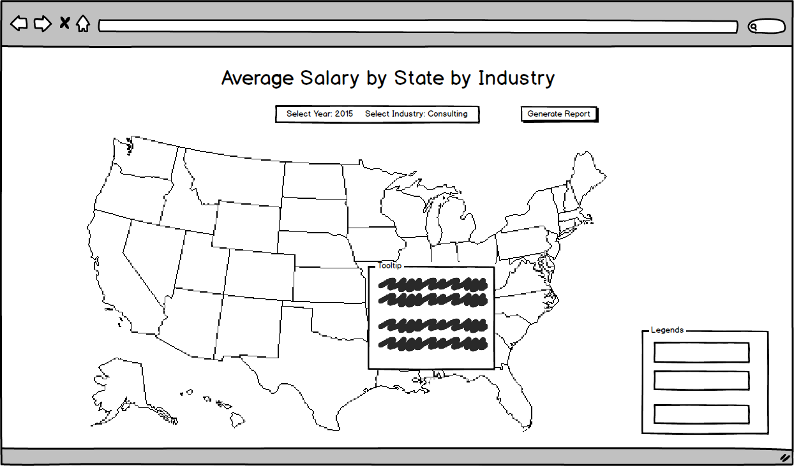

## topodata

#### [LIVE](https://topodata.herokuapp.com/)

### Proposal
This project is to show the average salary (wage) in the United States by state and by industry. I would like to add the ability to display historical data backing to 2011 if possible. Users will have the ability to filter by industry and also select the year. When they hover over each state, a tooltip will appear that shows the following items:

- State
- Job Title
- Max Salary
- Median Salary
- Min Salary

### Project Schedule

Day 1: Research D3 Library and TopoJSON documentation. Get a US map rendered and display on SVG canvas. Learn how to read CSV data into hashes.

Day 2: Finish Tooltip data dispay on hover and research on filtering data based on multiple criterias

Day 3: Adding multi-year data with a year slider that allows user to see the timeline trend

Day 4: Adding CSS and Update Production README.

Day 5: Finish Prouction README and bugfixes.

### Technologies that will be used
+ D3.js
+ JavaScript

### Features
+ Feature
+ Feature
+ Feature
